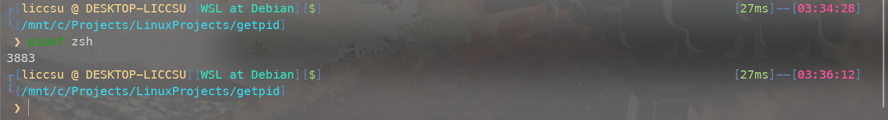
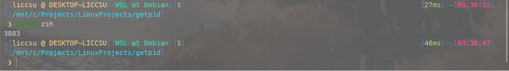
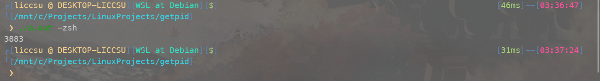

### 一、Linux中进程的用户管理

在Linux中，每个进程都拥有真实用户ID (==uid==)和真实组ID (==gid==)，有效用户ID (==euid==)和有效组ID (==egid==)，保存的设置用户ID (==suid==)和保存的设置组ID (==sgid==)，另外地，还有文件系统用户ID (==fsuid==)和文件系统组ID (==fsgid==)。

> (1) 真实用户、组 (uid/gid)：指的是进程的实际所有者和所属组，一般就是执行此进程的用户。
>
> (2) 有效用户、组 (euid/egid)：用来判断进程执行各种操作的权限。
>
> (3) 保存的设置用户、组 (suid/sgid)：是有效用户、组的副本，主要用来还原有效用户、组的值。
>
> (4) 文件系统用户、组 (fsuid/fsgid)：仅用来进行文件权限检查。


### 二、如何获取进程号？

(1) 通过`pidof`命令获取:



(2) 通过`pgrep`命令获取:



(3) 可以通过遍历`/proc`来获取：

> 在`/proc`下存在若干以数字命名的目录，这些数字就是PID，目录下有关于该进程的一些信息，其中`/proc/$pid/cmdline`文件里的内容便是进程名。

```c
pid_t get_pid_t(const char *cmd) {
    DIR *dir;
    FILE *file;
    struct dirent *ent;
    char filename[256], cmdline[256];
    pid_t pid = -1;
    dir = opendir("/proc");

    if (dir != NULL) {
        while ((ent = readdir(dir))) {
            if (ent->d_type == DT_DIR && STR_IS_INT(ent->d_name)) {
                snprintf(filename, sizeof(filename), "/proc/%s/cmdline", ent->d_name);
                file = fopen(filename, "r");
                if (file) {
                    fgets(cmdline, sizeof(cmdline), file);
                    fclose(file);
                    if (strcmp(cmd, cmdline) == 0) {
                        pid = atoi(ent->d_name);
                        break;
                    }
                }
            }
        }
        closedir(dir);
    }

    return pid;
}
```




### 三、通过进程号获取`struct pid`

先看一下`struct pid`的定义：

```c
struct pid
{
	atomic_t count; // pid的引用计数
	unsigned int level; // pid的层级
	/* lists of tasks that use this pid */
	struct hlist_head tasks[PIDTYPE_MAX];
	/* wait queue for pidfd notifications */
	wait_queue_head_t wait_pidfd;
	struct rcu_head rcu; // RCU头, 用于RCU同步机制
	struct upid numbers[1]; // 用于储存pid号的结构体数组
};
```


其中`struct upid`定义如下：

```c
struct upid
{
    /* Try to keep pid_chain in the same cacheline as nr for find_vpid */
    int nr;                        /* the pid value */
    struct pid_namespace *ns;      /* namespace */
    struct hlist_node pid_chain;   /* hash chain */
};
```


然后在`$(Linux-4.19)/kernel/pid.c`中可以发现这样一个函数：

```c
struct pid *find_get_pid(pid_t nr)
{
	struct pid *pid;

	rcu_read_lock();
	pid = get_pid(find_vpid(nr));
	rcu_read_unlock();

	return pid;
}
```


其中参数`nr`便是上面获取到的进程号

其中`find_vpid`和`get_pid`定义如下：

```c
struct pid *find_vpid(int nr)
{
	return find_pid_ns(nr, task_active_pid_ns(current));
}

static inline struct pid *get_pid(struct pid *pid)
{
	if (pid)
		atomic_inc(&pid->count);
	return pid;
}
```

其中`atomic_inc(&pid->count)`表示对`pid->count`进行原子级加一操作，所谓“原子”，就是最小的不可分解的最小执行单位，使用锁定总线的单指令进行不可分解的原子操作，以避免操作被中断或其他事件打断。


### 四、通过`struct pid`获取`struct task_struct`：

```c
struct task_struct *get_pid_task(struct pid *pid, enum pid_type type)
{
	struct task_struct *result;
	rcu_read_lock();
	result = pid_task(pid, type);
	if (result)
		get_task_struct(result);
	rcu_read_unlock();
	return result;
}
```

其中`struct task_struct`定义在`$(Linux-4.19)/include/Linux/sched.h`，太长了就只贴出本篇要用到的两个成员变量：

```c
struct task_struct
{
	...
	/* Objective and real subjective task credentials (COW): */
	const struct cred __rcu		*real_cred;

	/* Effective (overridable) subjective task credentials (COW): */
	const struct cred __rcu		*cred;
	...
}
```

看注释可以知道，其中`real_cred`指向客体和真实主体证书，`cred`指向有效主体证书，其结构体定义如下：

```c
struct cred {
	atomic_t	usage;
#ifdef CONFIG_DEBUG_CREDENTIALS
	atomic_t	subscribers;	/* number of processes subscribed */
	void		*put_addr;
	unsigned	magic;
#define CRED_MAGIC	0x43736564
#define CRED_MAGIC_DEAD	0x44656144
#endif
	kuid_t		uid;		/* real UID of the task */
	kgid_t		gid;		/* real GID of the task */
	kuid_t		suid;		/* saved UID of the task */
	kgid_t		sgid;		/* saved GID of the task */
	kuid_t		euid;		/* effective UID of the task */
	kgid_t		egid;		/* effective GID of the task */
	kuid_t		fsuid;		/* UID for VFS ops */
	kgid_t		fsgid;		/* GID for VFS ops */
	unsigned	securebits;	/* SUID-less security management */
	kernel_cap_t	cap_inheritable; /* caps our children can inherit */
	kernel_cap_t	cap_permitted;	/* caps we're permitted */
	kernel_cap_t	cap_effective;	/* caps we can actually use */
	kernel_cap_t	cap_bset;	/* capability bounding set */
	kernel_cap_t	cap_ambient;	/* Ambient capability set */
#ifdef CONFIG_KEYS
	unsigned char	jit_keyring;	/* default keyring to attach requested
					 * keys to */
	struct key __rcu *session_keyring; /* keyring inherited over fork */
	struct key	*process_keyring; /* keyring private to this process */
	struct key	*thread_keyring; /* keyring private to this thread */
	struct key	*request_key_auth; /* assumed request_key authority */
#endif
#ifdef CONFIG_SECURITY
	void		*security;	/* subjective LSM security */
#endif
	struct user_struct *user;	/* real user ID subscription */
	struct user_namespace *user_ns; /* user_ns the caps and keyrings are relative to. */
	struct group_info *group_info;	/* supplementary groups for euid/fsgid */
	/* RCU deletion */
	union {
		int non_rcu;			/* Can we skip RCU deletion? */
		struct rcu_head	rcu;		/* RCU deletion hook */
	};
};
```

### 五、更改权限

将得到的`struct cred`中的以下几个成员变量赋值`0`：

```c
	kuid_t		uid;		/* real UID of the task */
	kgid_t		gid;		/* real GID of the task */
	kuid_t		suid;		/* saved UID of the task */
	kgid_t		sgid;		/* saved GID of the task */
	kuid_t		euid;		/* effective UID of the task */
	kgid_t		egid;		/* effective GID of the task */
	kuid_t		fsuid;		/* UID for VFS ops */
	kgid_t		fsgid;		/* GID for VFS ops */
```

至此，就已经将一个进程提权至`root`了。
